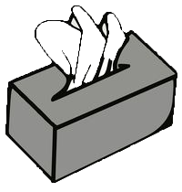

## Tissuebox
Tissuebox is a Pythonic schema validator. The standard use case would be validating the incoming JSON of the http request during REST-API calls.

### Installation:
Use pip to install Tissuebox like any other python package

`pip install tissuebox`

### Usage:

Tissuebox is highly readable and efficient schema validator for JSON objects implemented in Python. The JSON object would be converted as Python dict before validation takes place. 

###### Advantages:
- Tissuebox has lots of advantages than the current alternatives like jsonschema, cerebrus etc.
- Truly Pythonic and heavily relies on static methods and short lambdas
- Highly readable with concise schema definition. 
- Highly extensible with ability to insert your own custom methods without complicated code. 
